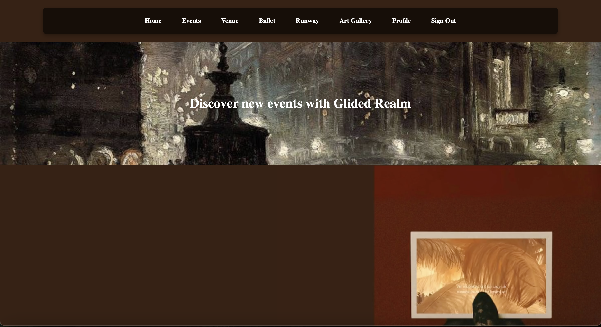
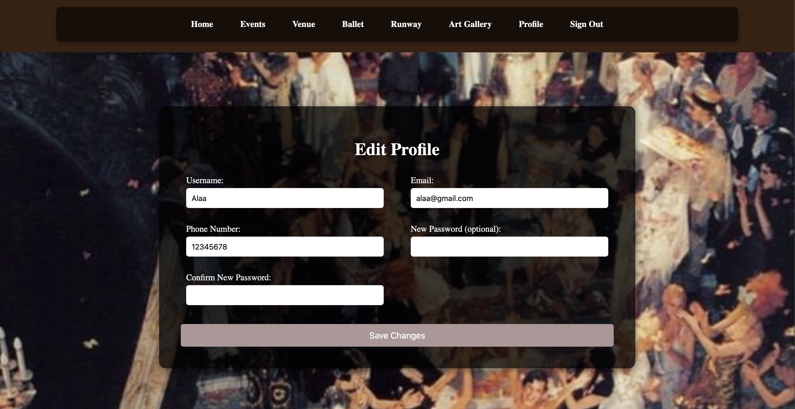
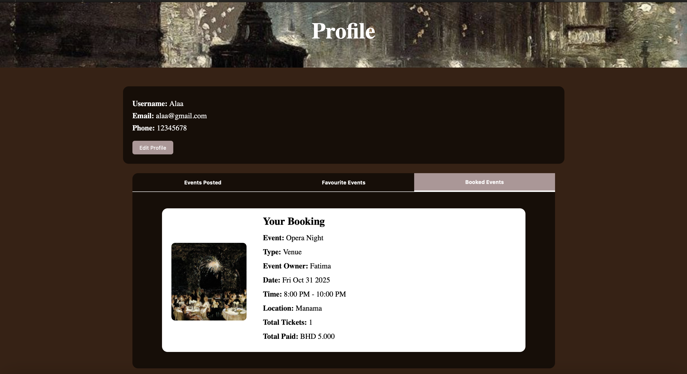
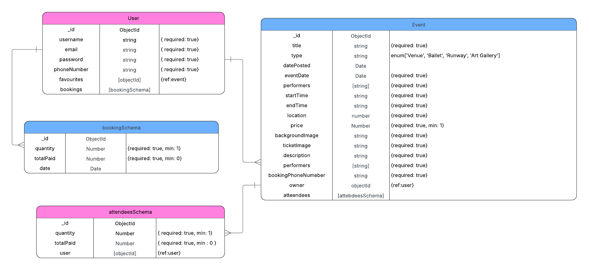

# Glided Realm

---

---

## 🎨 Project Title: Glided Realm

### What is Glided Realm?

**Glided Realm** is a web-based platform for posting, discovering, and booking events. Users can post events, and other users can view, favourite, and book tickets. The platform is designed for art and entertainment enthusiasts, featuring categories like:  

- **Venue:** Theatre, Opera, Parties  
- **Art Gallery**  
- **Ballet**  
- **Runway Shows**  

The website focuses on providing visually engaging, Pinterest-inspired layouts with images and videos for each event.

---

## 🌟 Why This Project?

I built **Glided Realm** to provide a digital space where art lovers can explore and attend curated events. Users can interact with events by booking tickets or saving favourites, creating a personal event management experience.

---

## 🧠 User Concept Overview

### Event Attendees / Users
* Browse events by category.
* View detailed information about events: title, type, date, time, location, description, performers, and organizer.
* Book tickets and see total payment.
* Favourite events for later reference.
* Track booked events and ticket history.

### Event Organizers / Users
* Post new events with background and ticket images.
* Edit or delete events they created.
* Manage ticket quantities, pricing, and event details.
* Monitor attendees and bookings.

### General Users
* Explore events without signing in, but need an account to book or favourite events.

---

## ✅ Website Features

* User registration and authentication (Sign Up / Sign In)  
* Browse events by category: Venue, Art Gallery, Ballet, Runway  
* View detailed event information  
* Book tickets and see total cost  
* Add events to favourites and track popularity  
* Profile tabs to view posted, booked, and favourited events  
* Organizers can manage events and monitor attendees  
* Visual, Pinterest-style event card layouts  
* Background images and ticket images for each event  

---

## 🚦 Routes

### **1. Authentication Routes**

| Method | Route            | Description                    |
| ------ | ---------------- | ------------------------------ |
| GET    | `/auth/sign-in`  | Display sign-in page           |
| POST   | `/auth/sign-in`  | Handle sign-in form submission |
| GET    | `/auth/sign-up`  | Display sign-up page           |
| POST   | `/auth/sign-up`  | Handle sign-up form submission |
| GET    | `/auth/sign-out` | Log out the user               |

---

### **2. User / Profile Routes**

| Method | Route                             | Description                                                      |
| ------ | --------------------------------- | ---------------------------------------------------------------- |
| GET    | `/users/:userId`                  | Display user profile (tabs for posted, favourite, booked events) |
| GET    | `/users/:userId/edit`             | Display edit profile page                                        |
| POST   | `/users/:userId/edit`             | Handle profile updates                                           |
| GET    | `/users/:userId/tickets/:eventId` | Display ticket for a booked event                                |

---

### **3. Event Routes**

| Method | Route                             | Description                                                              |
| ------ | --------------------------------- | ------------------------------------------------------------------------ |
| GET    | `/events`                         | Display all events                                                       |
| GET    | `/events/category/:categoryName`  | Display events filtered by category (Venue, Ballet, Runway, Art Gallery) |
| GET    | `/events/:eventId`                | Display single event details                                             |
| GET    | `/events/:eventId/edit`           | Display edit event page (owner only)                                     |
| POST   | `/events`                         | Create a new event                                                       |
| POST   | `/events/:eventId/book`           | Book tickets for a specific event                                        |
| POST   | `/events/:eventId/favourite`      | Add or remove event from favourites                                      |
| POST   | `/events/:eventId?_method=DELETE` | Delete an event (owner only)                                             |

---

### **4. Static / Miscellaneous**

| Method | Route                          | Description                                   |
| ------ | ------------------------------ | --------------------------------------------- |
| GET    | `/`                            | Homepage (featured events & discover section) |
| GET    | `/stylesheets/style.css`       | Main CSS file                                 |
| GET    | `/Assets/...`                  | Static assets (images, videos)                |

---

## 🗂️ ERD Diagram

---
## Project Management

For detailed project tracking and task management, visit my Trello board:

[Glided Realm Trello Board](https://trello.com/invite/b/68d16c89516455233f0e864e/ATTI94df1bd667c627f09c95cd2e2e8ebe09418C7E8B/glided-realm)

## 🚀 Getting Started

### 🖥️ Steps to Use Glided Realm

1. **Sign Up or Sign In**  
   * Create an account to post, favourite, or book events.

2. **Browse Events**  
   * Explore events by category.  
   * Click an event to view detailed information.

3. **Book Tickets**  
   * Select ticket quantity and complete booking.  
   * See total cost and confirmation.

4. **Favourite Events**  
   * Save events for future reference.

5. **Profile Management**  
   * View posted, favourited, and booked events.  
   * Edit personal details and password if needed.

6. **Organize Events (For Creators)**  
   * Add new events with images, date, time, ticket quantity, and price.  
   * Edit or delete events and monitor attendees.

---

## Assets & Inspiration

Images, videos, and layout inspiration for this project were sourced from [Pinterest](https://www.pinterest.com/), focusing on visual appeal and modern UI.  

> These assets are used for educational purposes and UI/UX inspiration only. All rights belong to the original creators.

---

## 🧪 Technologies Used

* **Backend:** Node.js, Express.js  
* **Frontend:** EJS Templates, HTML5, CSS3, JavaScript  
* **Database:** MongoDB  
* **File Uploads:** Multer for event background and ticket images  
* **Authentication:** Express Sessions, bcrypt for password hashing  
* **Design Tools:** Figma for low fedality mockups 
* **Styling & Layout:** Custom CSS  

---

## 🎯 Next Steps / Future Enhancements

1. Implement search functionality by keywords and filters.  
2. Add real-time notifications for bookings and event updates.  
3. Integrate social media sharing (Instagram, Pinterest, etc.).  
4. Add reviews and rating system for events.   
6. Develop an admin dashboard for analytics and event moderation.  

---